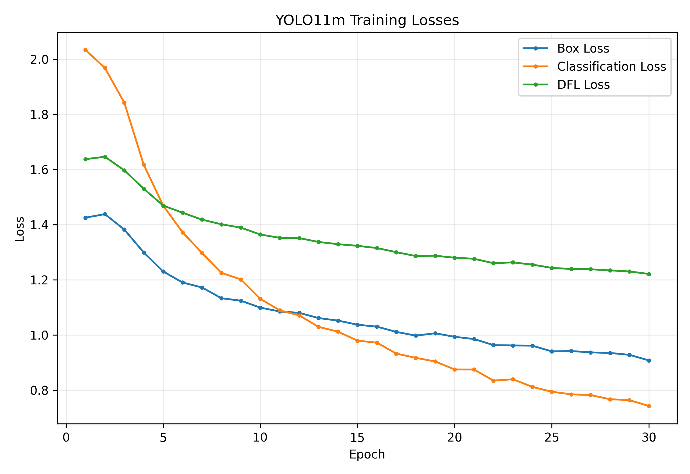
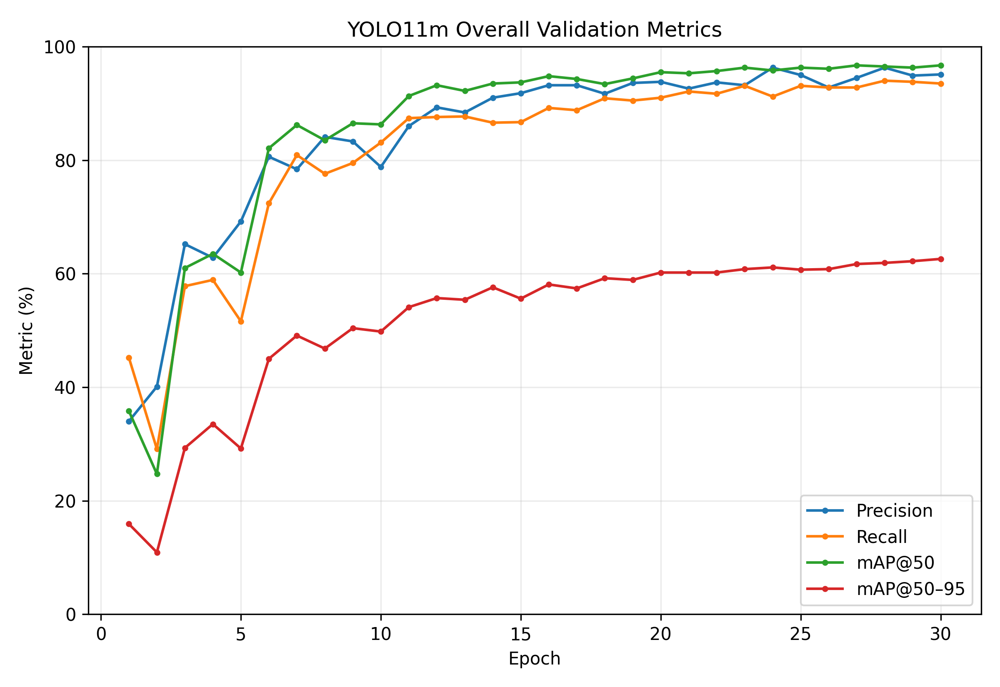
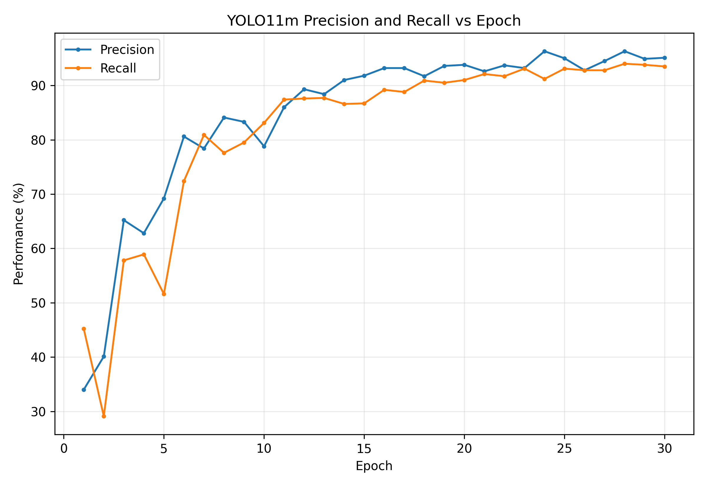
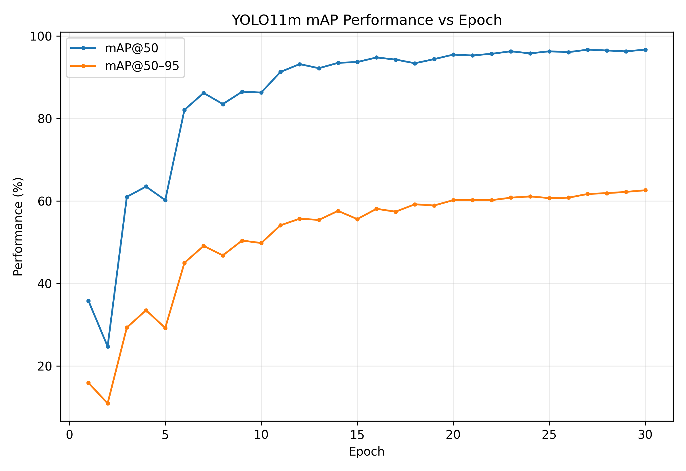
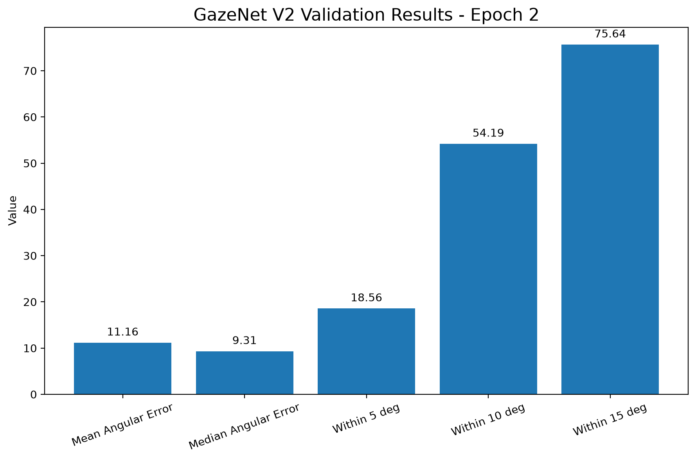
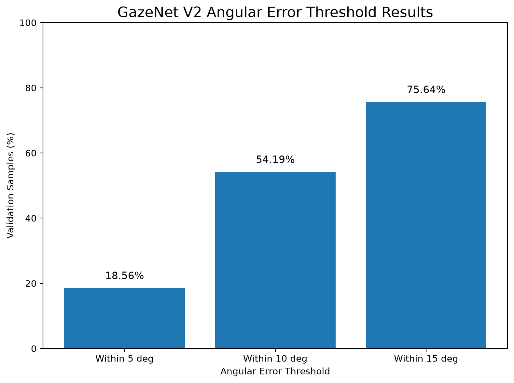
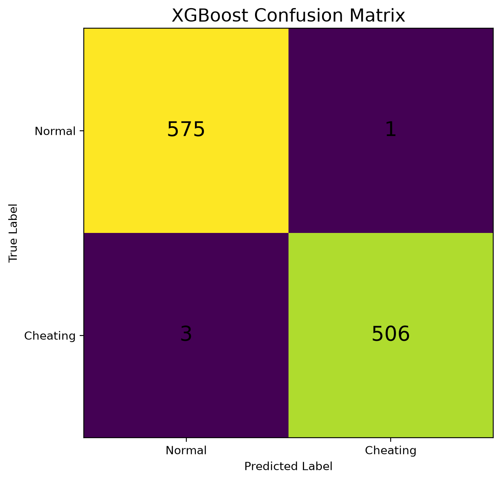
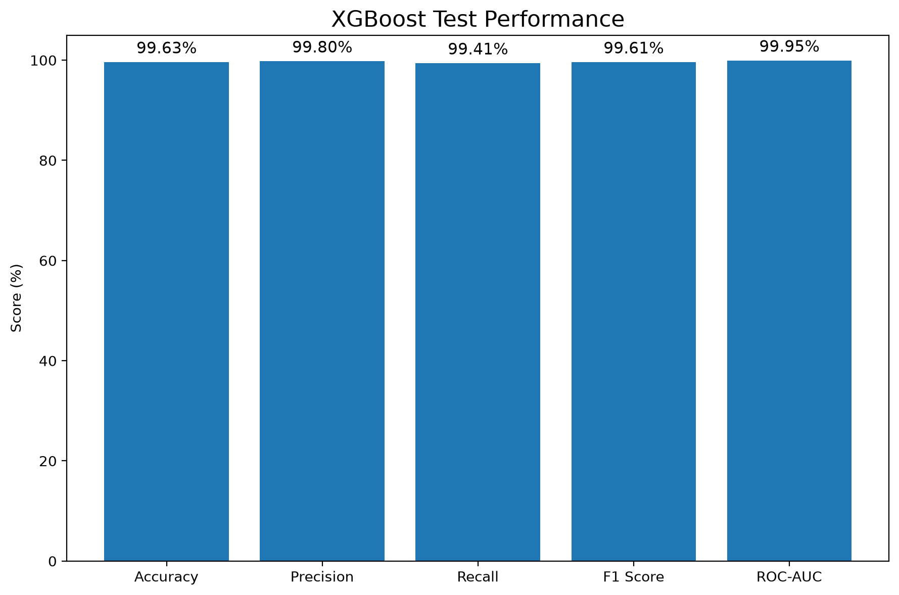
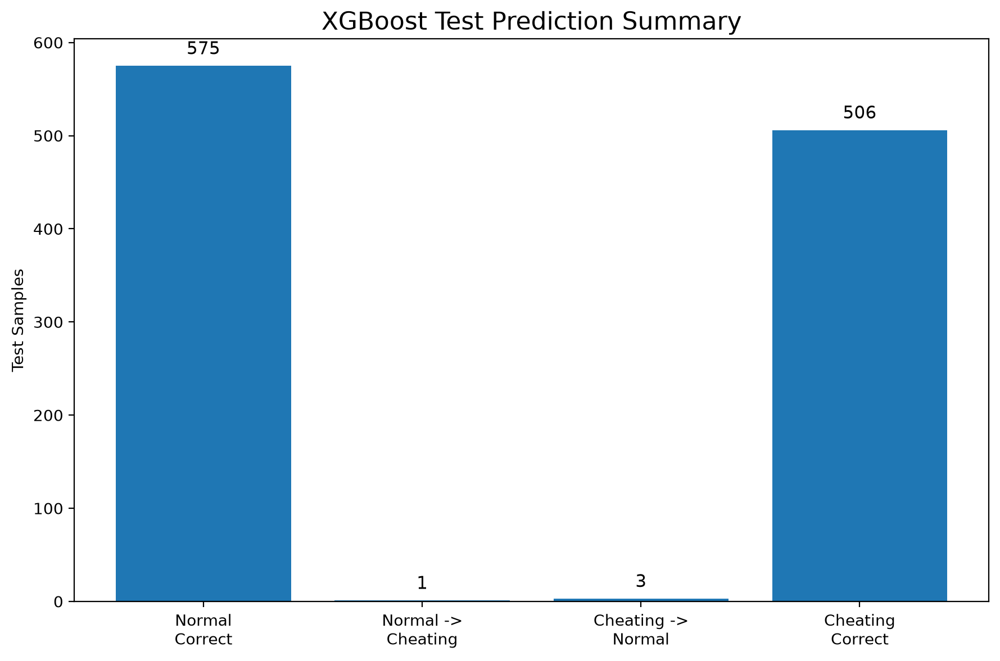

# Model Results

## 1. YOLO11m Object Detection

The exam surveillance object detection module uses YOLO11m trained for 9 exam-related classes:

1. phone
2. book
3. cheat_paper
4. calculator
5. earphone
6. sunglasses
7. watch
8. Answer_paper
9. laptop

### Training Configuration

| Parameter | Value |
|---|---|
| Model | YOLO11m |
| Epochs | 80 |
| Batch Size | 24 |
| Image Size | 640 |
| Optimizer | AdamW |
| Initial Learning Rate | 0.001 |
| Weight Decay | 0.0005 |
| Training Images | 16,185 |
| Validation Images | 970 |
| Test Images | 1,522 |

### Reported Results

| Metric | Result |
|---|---:|
| Best Precision | 95.2% |
| Best Recall | 95.0% |
| Best mAP@50 | 96.8% |
| Best mAP@50-95 | 62.6% |

The reported mAP@50 of 96.8% was observed during training, while the highest reported mAP@50-95 was 62.6%.

### Result Figures

## 2. GazeNet V2

GazeNet V2 is the gaze-estimation component of the surveillance pipeline. The model uses a ResNet18-based architecture with dataset embedding, shared representation, separate gaze heads, and a screen-classification auxiliary head.

### Validation Results

The following results correspond to Epoch 2 validation:

| Metric | Result |
|---|---:|
| Mean Angular Error | 11.1583° |
| Median Angular Error | 9.3080° |
| Samples within 5° | 18.56% |
| Samples within 10° | 54.19% |
| Samples within 15° | 75.64% |

These values represent gaze angular-error evaluation. They are not classification accuracy values.

### Result Figures

## 3. XGBoost Behavior Classification

XGBoost is used as the final behavioral classifier for the 37-feature representation extracted from the surveillance pipeline.

The classification labels are:

- Normal
- Cheating

### Test Dataset

The XGBoost evaluation used a held-out test split.

### Reported Test Results

| Metric | Result |
|---|---:|
| Accuracy | 99.63% |
| Precision | 99.80% |
| Recall | 99.41% |
| F1 Score | 99.61% |
| ROC-AUC | 0.9995 |

### Confusion Matrix

| | Predicted Normal | Predicted Cheating |
|---|---:|---:|
| Actual Normal | 575 | 1 |
| Actual Cheating | 3 | 506 |

### Result Figures

## 4. Important Evaluation Note

The reported metrics above belong to their respective trained components and evaluation datasets.

They should not be interpreted as a single end-to-end accuracy for the complete AI Exam Surveillance system.

End-to-end evaluation of the complete pipeline should be performed separately using subject/video-level testing and the complete inference pipeline.
